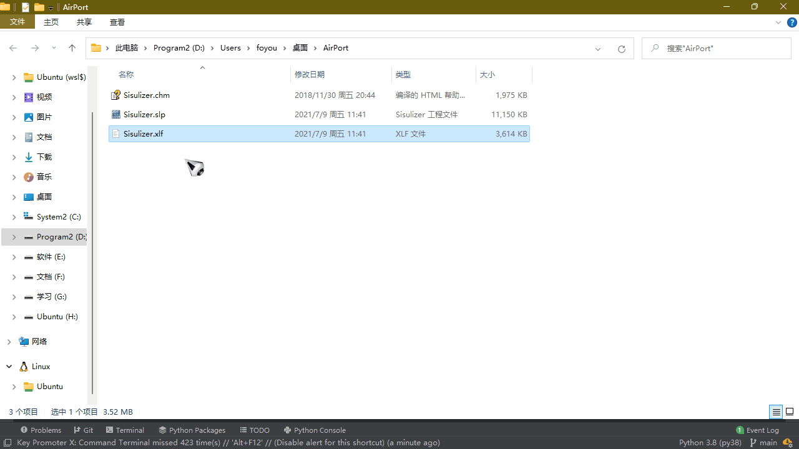
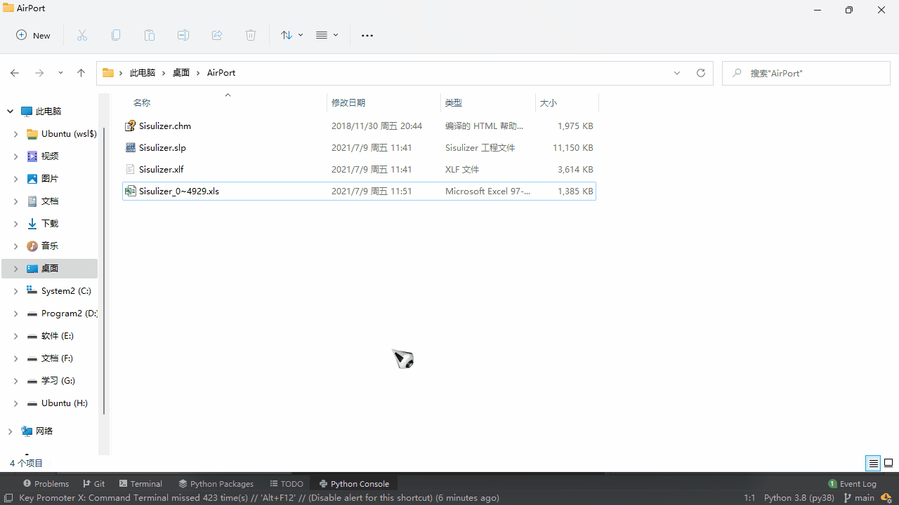
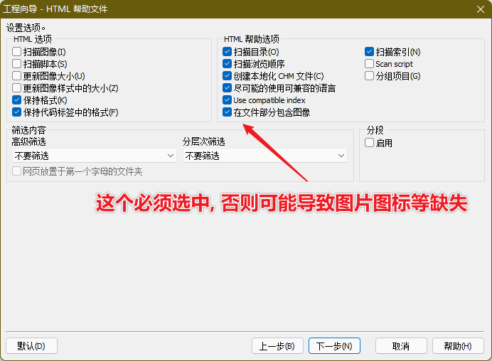
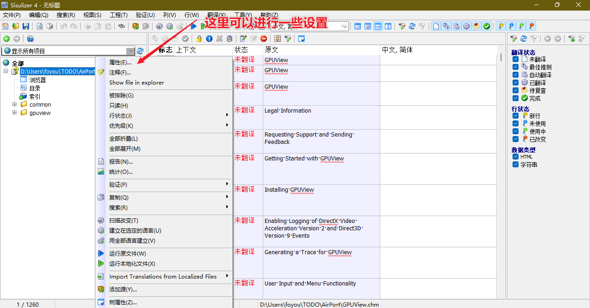
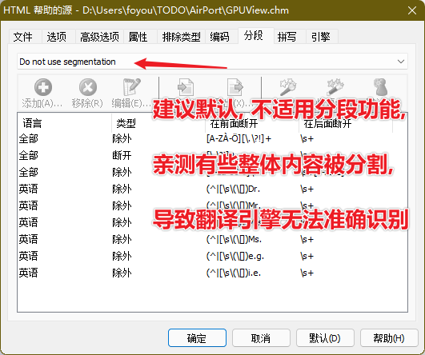
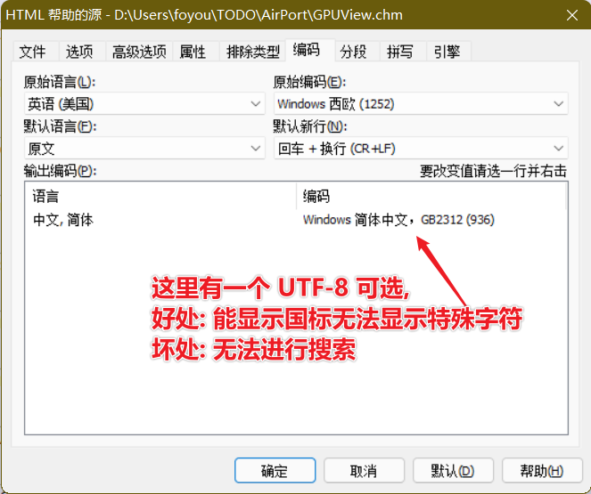
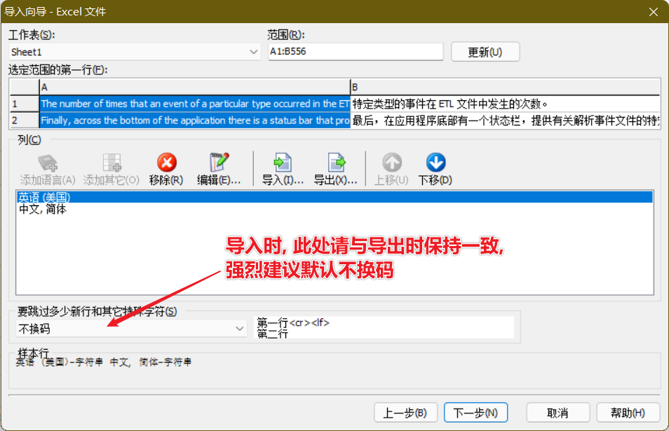

# docts

document translate, read &amp; translate &amp; write

借助 [pygtrans](https://github.com/foyoux/pygtrans) 链接谷歌机器翻译

  

---

## v0.1.0

> 由于上层依赖库问题，现需手动提供额外参数

```python
from docts import *

xlf_path = 'xlf_path.xlf'

# 使用示例方法
todo(xlf_path)

# 运行完毕后, 会在xlf_path同目录下生成一个翻译好的文件, 则直接导入 Sisulizer

# 现在需要手动构造 client 参数，具体参考：https://github.com/foyoux/pygtrans
client = Translate(proxies={"socks5": "http://localhost:10808"})
doc = Doc(xlf_path, client)
# WordFilters对象的add_filter等方法直接转移到, Doc对象中
doc.add_filter(xxx_filter)

# 保存文件也无需使用 write_xl* 
doc.save_words()

# 需要导出忽略文件时
doc.save_ignores()

```

---

- 从 **v0.0.7** 开始, 无需 **xlwings** 和 **Excel**, 废弃 **xls** 文件, 改用无限制的 **xlf**

- 代码结构也调整了, 从 **WordFilters** 转移到 **Doc**

  ```python
  from docts import *
  
  xlf_path='xlf_path.xlf'
  
  # 使用示例方法
  todo(xlf_path)
  
  # 运行完毕后, 会在xlf_path同目录下生成一个翻译好的文件, 则直接导入 Sisulizer
  
  # 自定义, 无需再使用 parse_xl* 方法解析字符串, Doc中自动处理
  doc = Doc(xlf_path)
  # WordFilters对象的add_filter等方法直接转移到, Doc对象中
  doc.add_filter(xxx_filter)
  
  # 保存文件也无需使用 write_xl* 
  doc.save_words()
  
  # 需要导出忽略文件时
  doc.save_ignores()
  
  ```

看着迷迷糊糊, 不妨动手试一试

--------

## 概述

此项目我暂时只用来结合 **Sisulizer** 翻译 **CHM帮助文档** , 但实际不仅于此, 支持配合 **Sisulizer** 翻译它所支持的所有格式, 理论上也是支持与其他本地化程序配合使用的.

实际案例: [InstallShield2020-Documents](https://github.com/foyoux/InstallShield2020-Documents)

简单步骤总结如下:

1. 使用 **Sisulizer** 提取 **字符串** 并导出为 **xlf** 或 **xls**
2. 使用此项目进行翻译并导出为`xls`文件
3. 在 **Sisulizer** 中导入 **xls** 文件, 并生成本地化文件
4. 完成, 预览

效果可参考: [InstallShield2020-Documents](https://github.com/foyoux/InstallShield2020-Documents)

## 环境准备

1. 安装Sisulizer4

   > 此项目测试环境为 Sisulizer4 374 版

   大家可自行搜索, 推荐: [软件本地化工具 Sisulizer Enterprise Edition 4.0 Build 374 中文免费版](http://www.dayanzai.me/sisulizer.html)

2. 安装HTML Help Workshop

   可自行搜索下载, 项目 **files** 目录下也有提供 **htmlhelp.exe**

3. 配置Sisulizer

   在菜单: 工具->平台->HTML, [如图设置](images/image-20210626144042156.png)

*注意*

- 你当然只能在 **Windows** 系统里操作
- 由于依赖 **xlwings**, 而它是依赖 **Excel** 的, 所以你必须安装 **Excel**, 后期会考虑移除此依赖

## 快速入门

以 **Sisulizer** 帮助文档为例

1. 利用Sisulizer解析字符串并导出

   

2. 利用 **docts** 进行翻译

   安装: `pip install docts`

   

3. 在 **Sisulizer** 中导入翻译好的 **xls** 文件, 并生成本地化文件

   

## 详细教程

**Sisulizer** 只支持 **xls** 文件, 这限制了导出条目在 **65536** 内, 所以引入了 **xlf**, **xlf** 文件是一种 **xml** 文本格式, 没有这个限制, 但是 **xls**
的读写比 **xlf** 方便一些, 为了 方便(简单), 省事(偷懒)起见, 翻译的整体步骤就是:

1. 导出 **xlf**
2. 读取 **xlf** 中的字符串, 然后翻译, 最后写入 **xls**, 如果超过 **65536** 条就分多个文件写入.
3. 之后再导入回 **Sisulizer** 中.

基于这个总的前提和思路, 你需要配置好环境:

1. 安装Excel
2. Python, (最好再配个 PyCharm)
3. 再就是这个包 `pip install docts`, 或者自己写代码, 解析 **xlf**, 和 **xls**

### Sisulizer简单介绍

**Sisulizer** 支持很多文件, 比如常见的:

- 文本类型: **TXT** / **CSV** / **HTM** / **HTML** / **XHTML** / **SHTML** / **XML** / **INI** / **JSON** / **XLF** / **
  properties** / **PO** / **XAML** ...
- 源码类型: **.c** / **.cpp** / **.h** / **.sql** / **.cs** / **.js** / **.php** / **.ts** / **.java** / ...
- 二进制类型: **.exe** / **.dll** / **.apk** / **.jar** / ...
- 太多了

**Sisulizer** 支持单个翻译和批量翻译, 并且支持多种语言, 丰富的设置选项与功能.

参照上面快速入门中的步骤, 此项目理论上支持任何 **Sisulizer** 支持的文件, 而不仅仅可以用来翻译 **CHM** 文件. 这套路理论上也是支持其他翻译工具的,
此项目核心其实就是 [pygtrans](https://github.com/foyoux/pygtrans) , 它支持 **十万** 的批量翻译, 只要将导出内容解析, 然后用它翻译, 重写回去, 再到相应工具导入即可.

[Sisulizer简易教程]()

### 使用Sisulizer翻译CHM文档的完整过程

大致步骤大家看 **快速入门中的动图**, 下面主要讲解一些选项的区别, 与 **docts** 的使用

1. 在工程向导中, 请一定要选中图中选项, 否则会导致图片图标缺失的问题, 亲自踩的坑

   

2. 如图, 在文件上右击, 会有属性菜单, 里面可以对工程向导中的选项进行更改或重新选择

   

   

   

3. **Sisulizer** 相关注意点就讲完了, 接下来介绍翻译部分

### 翻译部分

我们不可能一股脑的, 把所有的字符串拿去翻译, 最起码你得稍微过滤一下需要翻译的句子吧:

- 空字符串

- 重复字符串

  ```python
  # 导包
  from docts import *
  # 定义文件路径
  xlf=r'demo.xlf'
  
  # 使用 parse_xlf 方法提取全部字符串
  # 这个过程会自动去重, 删除 '' 字符串
  words=parse_xlf(xlf)
  # 将提取到字符串列表 words 作为参数, 创建一个 WordsFilter 过滤器对象
  wf=WordsFilter(words)
  ```

- 你可能还需要把不含字母的字符串去掉, 比如: '•', 你可以这样做

  ```python
  # 使用 WordsFilter 的 add_filter 方法
  # 它的参数一个 "参数是一个字符串, 返回值是布尔类型的函数"
  def filter_point(word: str):
      if word=='•':
          # 返回True, 代表过滤
          return True
      return False
  
  # 它会被自动应用到每一个字符串句子上
  wf.add_filter(filter_point)
  ```

- 你可能想把所有的 '•' 变成 '●', 因为前者是 **UTF-8** 的编码, 在翻译后的文件中的 **GB2312** 无法正常显示, 而翻译或过滤并不能解决这个问题, 这是你希望将 '•' 变成 '●'

  ```python
  # 这时你可以使用 WordsFilter 的 add_map 方法, 这叫映射
  # 同样的你需要定义个 映射器
  def map_point(word: str):
      return word.replace('•', '●')
  # map_point 会被自动映射到每一个字符串上
  wf.add_map(map_point)
  ```

- 你翻译的文件中, 可能包含很多代码, 而 **Sisulizer** 未能按你的期望, 将它们过滤掉, 你需要通过代码处理

  ```python
  # 比如需要将含有 ' = ' 的字符串认定为代码, 需要将其过滤掉
  # 你可以使用 WordsFilter 的 add_contain_filter 方法
  # 这个是支持正则表达式的
  wf.add_contain_filter(' = ')
  
  # 在含有C语言代码的句子中, '#define ...' 可能比较常见, 
  # 一般的以 '#define' 开头的句子, 我们基本可以认定为是代码, 我们需要将其过滤掉
  # 我们可以使用 WordsFilter 的 add_start_filter 方法
  wf.add_start_filter('#define')
  # 可能它的前面包含很多空格, 只需添加 strip 参数即可
  wf.add_start_filter('#define', strip=' ')
  # 当然你也可以使用 add_contain_filter 方法
  # 因为它是支持正则表达式的, 你可以使用 '^' 匹配空格
  wf.add_contain_filter('^ *#define')
  
  # 同样的也有 add_end_filter add_replace 等方法供你使用
  ```

- 当你觉得差不多了

  ```python
  # 提取需要翻译的字符串进行翻译
  ens = wf.words
  # 调用 write_xls 函数进行翻译并写出到文件
  # 
  #    写入原文和翻译到xls工作表
  #    :param xls_path: 路径
  #    :param origins: 源字符串
  #    :param trans: 目标字符串, 如果为空, 会直接将 origins 翻译为中文作为其值
  #    :param step: 由于 xls 限制 65536, 超过就只能 分文件, 这个参数意思就是说多少个字符串分一个文件
  #    :return:
  write_xls(xlf, ens)
  ```

- 将写出的 **xls** 文件在 **Sisulizer** 中导入

  

- 当你导入完成, 在 **Sisulizer** 中浏览时, 你发现多翻译了, 把不该翻译的代码也给翻译了, 你需要纠正

  ```python
  # 怎么纠正呢?
  # 如果重新翻译, 岂不是太麻烦了?
  # 这时我们可以使用, WordsFilter 中的另一个属性
  ignores = wf.wf.ignores
  write_xls(xlf, ignores, ignores)
  # 这样就不要重新翻译了, 只需把错误翻译的替换为原文即可, 然后慢慢调整, 知道满意为止
  
  # 这个项目就先这样了, 大家有问题可以 issue 一起讨论下
  # 中途我是有打算重新整理下, 因为感觉有点太随意, 不系统. 
  # 但由于时间问题, 也没很好的组织架构想法, 也就算了, 这样也是可以用用的, 总比没的好
  # 大家可以看看 [InstallShield2020-Documents](https://github.com/foyoux/InstallShield2020-Documents)
  # 觉得翻译得还挺满意, 总比全是英文强.
  # 之前有把 chm 转为 PDF, 再利用谷歌的文档翻译功能, 结果惨不忍睹, 太惨了, 
  
  ```

## CHM相关

-
微软推出的一种[帮助文档格式](https://docs.microsoft.com/en-us/previous-versions/windows/desktop/htmlhelp/microsoft-html-help-1-4-sdk)
, 实际上是一个 **压缩包**+**自定义块数据**

- 通过解压缩工具或 `hh.exe -decompile folder file.chm` 命令可进行反编译, 此命令系统自带

- 重编译需要 **HTML Help Workshop** (项目 **files** 目录下有提供), 官网已经找不到下载了, 网上能找到最新版本是`1999年发布`的, 😂, 但是可以用.

- 注意: 反编译的是不支持直接重新编译的, 因为缺少 **.hhp** 工程文件, `hhc.exe project.hhp` 命令可编译 **CHM** 文件, 依赖 **HTML Help Workshop**

- 网上找到两款免费可以重编译 **CHM** 文件的工具

    1. KeyTools: 亲测可用, 项目 **files** 目录下有提供
    2. Precision Helper: 未测试

- 翻译 **CHM文档** 的一般套路如下:

    1. 反编译CHM
    2. 借助工具翻译HTML文件
    3. 重编译

  此项目借助 **Sisulizer** 直接支持CHM文档的特性进行操作, 个人觉得这个方法更Nice, 因为我想没有哪个本地化程序是无限制提供免费机器翻译的, 并且也不可能达到 **10万条句子**/**10s** 的速度.

- **Sisulizer** 本身是支持 **机器翻译** 的, 可能由于盗版问题严重, 已全面停用了这一功能.

- **Sisulizer** 只支持旧版 **Excel** 格式的 **xls** 文件, 而 **xls** 工作表最多只支持 **65536条数据**, 当导出句子大于这一数量时, 会丢失数据, 所以建议导出统一使用 **
  XLIFF** 选项导出为 **xlf** 文件, **dcots** 导出时会自动分量 **xls** 文件导出.

- 软件本地化工具:  都好久没更新了, 三年吧

    1. [Sisulizer](https://www.sisulizer.com/): 使用简单, 功能强大, 我比较喜欢, 最新版是2018发布的 **374** 版

       [(2018版, 似乎也是最新版)支持的文件类型](images/image-20210626142536447.png)

    2. [SDL Passolo](https://www.trados.com/products/passolo/): 这个比较出名, 不过用得很少, 最新版也是2018出的

       [(2018版, 似乎是最新版)支持的所有文件类型](images/image-20210626142113761.png)

    3. Radialix : 这个也用得很少, 没前面两个出名

- 文件本地化工具:

    1. [SDL Trados Studio](https://www.trados.com/products/trados-studio/): 和 **SDL Passolo** 同家, 目前最厉害的文件本地化工具吧

       [(2021版)支持的所有文件类型](images/image-20210626141828377.png)

> 2021年07月08日22时14分53秒
